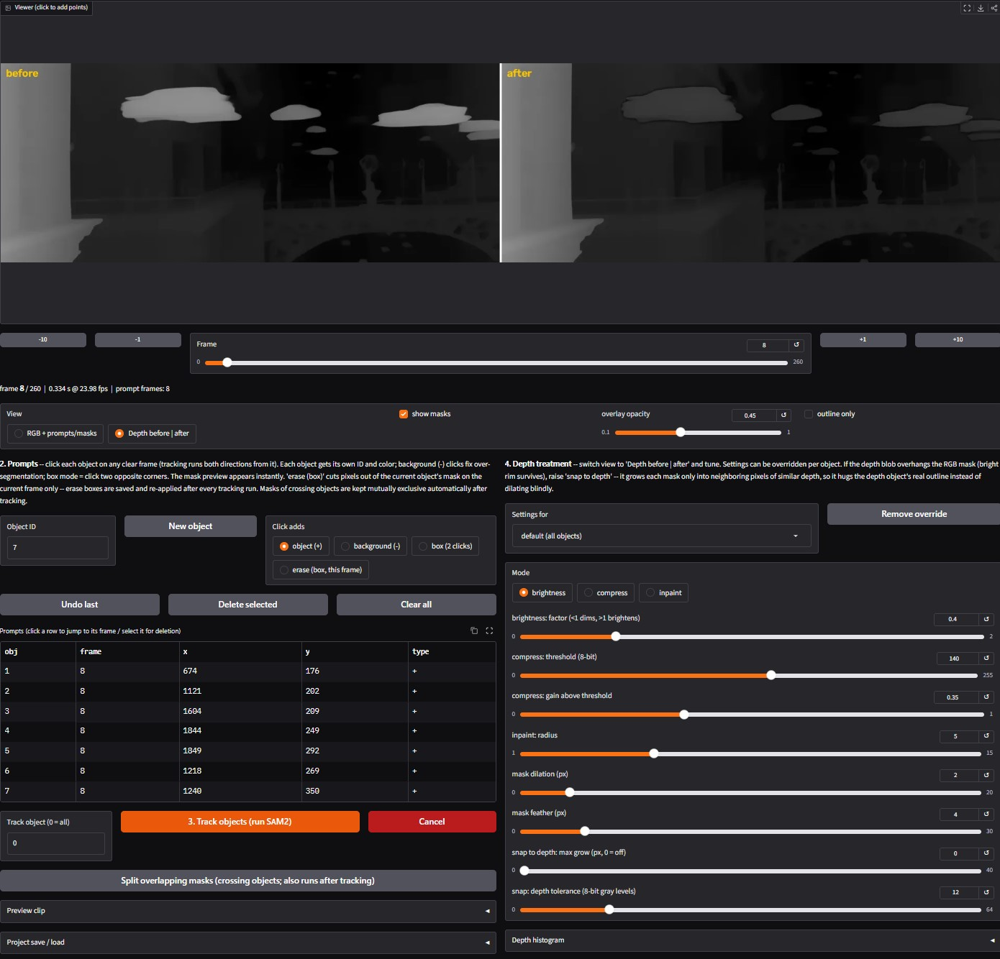

# SAM2 Depth Masker

A local, single-file browser GUI for cleaning up **depth-map videos** (e.g. [DepthCrafter](https://github.com/Tencent/DepthCrafter) output) by tracking objects in the matching **RGB video** with [SAM 2.1](https://github.com/facebookresearch/sam2) and then dimming or brightening those objects in the depth video.

Typical use case: a shot contains objects (drones, birds, flying vehicles, foreground clutter) that punch bright "near" blobs into an otherwise clean depth map. You click them once in the RGB clip, SAM2 tracks them through the whole shot, and the tool re-renders the depth video with those objects pushed back, flattened, or removed — at full 10-bit precision.



Everything runs locally (Gradio at `http://127.0.0.1:7860`), nothing is uploaded anywhere.

## Features

- **Click-to-mask prompting** on the RGB video: positive/negative points and 2-click boxes, multiple objects with per-object IDs and colors, instant single-frame mask previews, corrective clicks.
- **Bidirectional SAM2 video tracking** from any prompt frame; objects prompted on different frames are propagated in separate clean passes. Per-object re-tracking.
- **Crossing-object handling**: after tracking, per-frame masks are kept mutually exclusive — a mask fully swallowed by another object's blob (the classic SAM2 "merge") gets its area back automatically; partial overlaps are split by proximity with motion continuity. Plus **erase modes** for surgical frame-by-frame fixes that survive re-tracking: an erase box, and a single-click erase that works like a background (−) click for one frame only — SAM2 re-segments the tracked mask with your click as a negative point and carves out just the region you clicked (auto-detects which object it belongs to; falls back to connected-blob deletion without SAM2).
- **Snap to depth**: SAM2 masks follow RGB silhouettes, which rarely match the depth blobs exactly. An edge-aware grow (geodesic dilation + marker watershed) expands each mask to the depth object's true outline — without leaking into occluders like walls whose gray value happens to be similar.
- **Depth ghost**: optionally blend a TURBO-colormapped copy of the depth video into the frames SAM2 sees, so depth boundaries become color edges the tracker can latch onto. Handles depth videos at lower resolution / different aspect ratio than the RGB. Mask overlay colors automatically switch to hues the colormap never produces.
- **Brightness treatment**, tunable live in a before|after view, globally or per object: factor < 1 pushes the object deeper (dims), > 1 pulls it closer (brightens). Mask dilation + feather controls and a depth histogram of the masked pixels.
- **10-bit end-to-end**: 10-bit sources (e.g. DepthCrafter HEVC) are decoded via ffmpeg at 16-bit, processed in 16-bit, and rendered back to **10-bit HEVC** — no banding introduced. 8-bit sources render as 8-bit H.264 as before.
- **Renders never overwrite** existing files; optional **mask matte export** (`*_matte.mp4`) for external compositing; test-render of a short range before committing to the full clip.
- **Project save/load** (`.npz`): prompts, masks, erase boxes, and all settings. Last-used paths and settings persist in `s2dm_config.json`.
- Cancel button for long operations; keyboard scrubbing (`←`/`→` = 1 frame, `Shift+←`/`→` = 10).

## Requirements

- Windows 10/11 (developed and tested there; the Python code itself has no Windows-only dependencies)
- Python 3.10+
- An NVIDIA GPU with CUDA (CPU works but is very slow for tracking)
- [Git](https://git-scm.com/) on PATH (the SAM2 package installs from GitHub)
- **ffmpeg** (strongly recommended: required for 10-bit precision and the cleanest encodes): `winget install Gyan.FFmpeg`

## Install

```bat
git clone https://github.com/enoky/DepthEditorGUI.git
cd DepthEditorGUI
py -m venv .venv
.venv\scripts\activate
py -m pip install -r requirements.txt
```

`requirements.txt` pins PyTorch CUDA 13.0 wheels (`cu130`), which need an R580+ NVIDIA driver — if yours is older, edit the two `cu130` occurrences to `cu126`.

Download the SAM 2.1 checkpoint (~900 MB) into `checkpoints\`:

- [sam2.1_hiera_large.pt](https://dl.fbaipublicfiles.com/segment_anything_2/092824/sam2.1_hiera_large.pt)

## Run

```bat
RUN_SAM2_gui.bat
```

or, with the venv active, `python sam2_depth_gui.py`. A browser tab opens at `http://127.0.0.1:7860`.

## Workflow

1. **Load** the RGB video and the matching depth video. Optionally set **depth ghost (%)** first (try 25–35) to blend colormapped depth into the frames SAM2 sees.
2. **Prompt**: scrub to a clear frame and click each object (or box it). Background (−) clicks fix over-segmentation. Each object gets its own ID — use *New object* between vehicles.
3. **Track objects** (SAM2 propagates forwards and backwards). Scrub or render a preview clip to verify; add corrective clicks where it drifts and track again. Fix crossing-object mistakes with *Split overlapping masks*, the *erase (box)* mode, or *erase (click a blob)* for stray fragments.
4. **Depth treatment**: switch the view to *Depth before | after* and tune the brightness factor. If bright rims of the depth blob survive outside the mask, raise **snap to depth: max grow** — it hugs the depth object's real outline instead of dilating blindly. Settings can be overridden per object.
5. **Render**. Existing files get a numeric suffix instead of being overwritten. Optionally export the mask matte for compositing.

## Notes & tips

- Masks are stored at depth-video resolution; clicks and masks map between RGB and depth by normalized coordinates, so resolution or aspect mismatches between the two videos are handled (the depth is stretched to fit — double-check the before|after view if the aspect ratios differ).
- The **test render** preview clip is intentionally encoded as 8-bit H.264 so it plays inline in any browser; the final render is 10-bit HEVC when the source is 10-bit. Processing is identical in both.
- A brightness factor of 0.35–0.5 usually reads as "pushed comfortably into the background"; values near 0 effectively remove the object into the far plane.
- Tracking speed is roughly 14 fps at 1920×800 on an RTX 5080 with the hiera-large checkpoint.
- All state lives in memory plus `s2dm_config.json` (remembered paths/settings) — save a project `.npz` before closing if you want to resume.

## Files

| File | Purpose |
|---|---|
| `sam2_depth_gui.py` | the entire app |
| `requirements.txt` | pinned dependencies (PyTorch cu130, Gradio, OpenCV, SAM2) |
| `RUN_SAM2_gui.bat` | activate venv + launch |
| `checkpoints/` | put `sam2.1_hiera_large.pt` here |
| `s2dm_config.json` | auto-written: last-used paths and settings |
